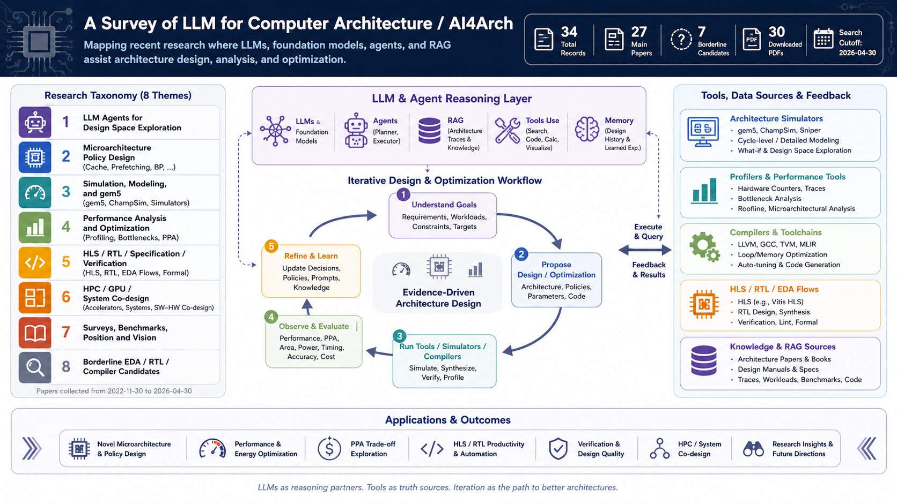

# LLM for Computer Architecture / AI4Arch 文献调研

**语言切换：** [English](README.md) | 中文



本仓库整理 **LLM / 基础模型 / Agent / RAG 辅助计算机体系结构、HLS、仿真建模与系统协同优化** 方向的论文、索引表、分类综述和开放 PDF。

## 项目简介

本项目从 ChatGPT/GPT-3.5 公开发布后的 **2022-11-30** 开始收录文献。纳入标准相对严格：论文必须实质使用 LLM、基础模型、多模态大模型、LLM Agent 或 RAG 体系，来辅助计算机体系结构或相关芯片/系统设计任务。

默认排除：

- 纯粹的 **Arch for AI/LLM**，例如 LLM 推理/训练加速器，除非论文的核心方法是用 LLM 反过来辅助架构设计或探索。
- 传统 ML/RL/BO/GNN-only 的 AI for Architecture 工作不进入主集。
- 纯 RTL/Verilog 生成论文默认放入边界候选，除非涉及架构探索、HLS pragma、PPA tradeoff 或微架构推理。

## 当前统计

检索截止：**2026-04-30**

| 项目 | 数量 |
|---|---:|
| 总记录 | 34 |
| 主集论文 | 27 |
| 边界候选 | 7 |
| 已下载 PDF | 30 |
| 未下载 | 4 |

## 快速入口

| 文件 | 说明 |
|---|---|
| [literature_index_by_category.md](AI_for_Arch_LLM_Literature/literature_index_by_category.md) | 按方向分组的快速浏览表 |
| [literature_cards.md](AI_for_Arch_LLM_Literature/literature_cards.md) | 逐篇详细卡片 |
| [download_summary.md](AI_for_Arch_LLM_Literature/download_summary.md) | PDF 下载状态和未下载原因 |
| [taxonomy_review.md](AI_for_Arch_LLM_Literature/taxonomy_review.md) | 中文分类综述 |
| [literature_index.xlsx](AI_for_Arch_LLM_Literature/literature_index.xlsx) | 可筛选 Excel 表 |
| [literature_index.csv](AI_for_Arch_LLM_Literature/literature_index.csv) | 完整 CSV 索引 |
| [references.bib](AI_for_Arch_LLM_Literature/references.bib) | BibTeX 文献库 |
| [download_log.csv](AI_for_Arch_LLM_Literature/download_log.csv) | 下载日志 |

## 目录结构

```text
.
|-- README.md
|-- README.zh-CN.md
|-- build_literature_library.py
|-- fig/
`-- AI_for_Arch_LLM_Literature/
    |-- 01_LLM_Agents_for_DSE/
    |-- 02_LLM_for_Microarchitecture_Policy_Design/
    |-- 03_LLM_for_Simulation_Modeling_and_gem5/
    |-- 04_LLM_for_Performance_Analysis_and_Optimization/
    |-- 05_LLM_for_Hardware_Spec_RTL_Verification_when_arch_relevant/
    |-- 06_LLM_for_HPC_System_Codesign/
    |-- 90_Surveys_Position_and_Vision/
    |-- 99_Candidates_Borderline/
    |-- literature_index_by_category.md
    |-- literature_cards.md
    |-- download_summary.md
    |-- literature_index.xlsx
    |-- literature_index.csv
    |-- references.bib
    `-- download_log.csv
```

## 分类方向

| 目录 | 方向 |
|---|---|
| [01_LLM_Agents_for_DSE](AI_for_Arch_LLM_Literature/01_LLM_Agents_for_DSE) | LLM/Agent 引导的设计空间探索 |
| [02_LLM_for_Microarchitecture_Policy_Design](AI_for_Arch_LLM_Literature/02_LLM_for_Microarchitecture_Policy_Design) | cache、prefetching、branch prediction 等微架构策略设计 |
| [03_LLM_for_Simulation_Modeling_and_gem5](AI_for_Arch_LLM_Literature/03_LLM_for_Simulation_Modeling_and_gem5) | gem5/ChampSim 工作流、仿真器测试、建模与分析 |
| [04_LLM_for_Performance_Analysis_and_Optimization](AI_for_Arch_LLM_Literature/04_LLM_for_Performance_Analysis_and_Optimization) | LLM 辅助性能分析、编译器优化与系统优化 |
| [05_LLM_for_Hardware_Spec_RTL_Verification_when_arch_relevant](AI_for_Arch_LLM_Literature/05_LLM_for_Hardware_Spec_RTL_Verification_when_arch_relevant) | 与架构相关的 HLS、RTL、规范、验证和 PPA 工作 |
| [06_LLM_for_HPC_System_Codesign](AI_for_Arch_LLM_Literature/06_LLM_for_HPC_System_Codesign) | HPC/GPU/系统层软件-硬件协同设计 |
| [90_Surveys_Position_and_Vision](AI_for_Arch_LLM_Literature/90_Surveys_Position_and_Vision) | 综述、benchmark、position paper 和 vision paper |
| [99_Candidates_Borderline](AI_for_Arch_LLM_Literature/99_Candidates_Borderline) | 边界 EDA/RTL/compiler 候选论文 |

## 如何使用

快速浏览建议先看：

```text
AI_for_Arch_LLM_Literature/literature_index_by_category.md
```

逐篇细读建议看：

```text
AI_for_Arch_LLM_Literature/literature_cards.md
```

需要筛选和排序时打开：

```text
AI_for_Arch_LLM_Literature/literature_index.xlsx
```

需要导入文献管理工具时使用：

```text
AI_for_Arch_LLM_Literature/references.bib
```

## 复现方式

索引、Markdown 视图、BibTeX、XLSX 和下载日志由以下脚本生成：

```powershell
python build_literature_library.py
```

脚本会：

- 创建分类目录；
- 优先从 arXiv、开放获取版本或作者公开页面下载 PDF；
- 写入 `literature_index.csv` 和 `literature_index.xlsx`；
- 写入快速浏览和逐篇阅读用的 Markdown 文件；
- 写入 `references.bib`；
- 写入 `download_log.csv` 和 `download_summary.md`。

## PDF 与版权说明

本仓库中的 PDF 仅来自 arXiv、开放获取版本或作者公开页面。本项目不会绕过 IEEE/ACM 或出版商的闭源访问限制。未能下载的论文会在 [download_summary.md](AI_for_Arch_LLM_Literature/download_summary.md) 和 [download_log.csv](AI_for_Arch_LLM_Literature/download_log.csv) 中记录正式链接、DOI、开放版本链接和失败原因。

## 维护状态

这是截至 **2026-04-30** 的研究快照。该方向仍在快速发展，尤其是 agentic architecture design、RAG trace reasoning、HLS DSE 和 LLM-assisted HPC optimization。
